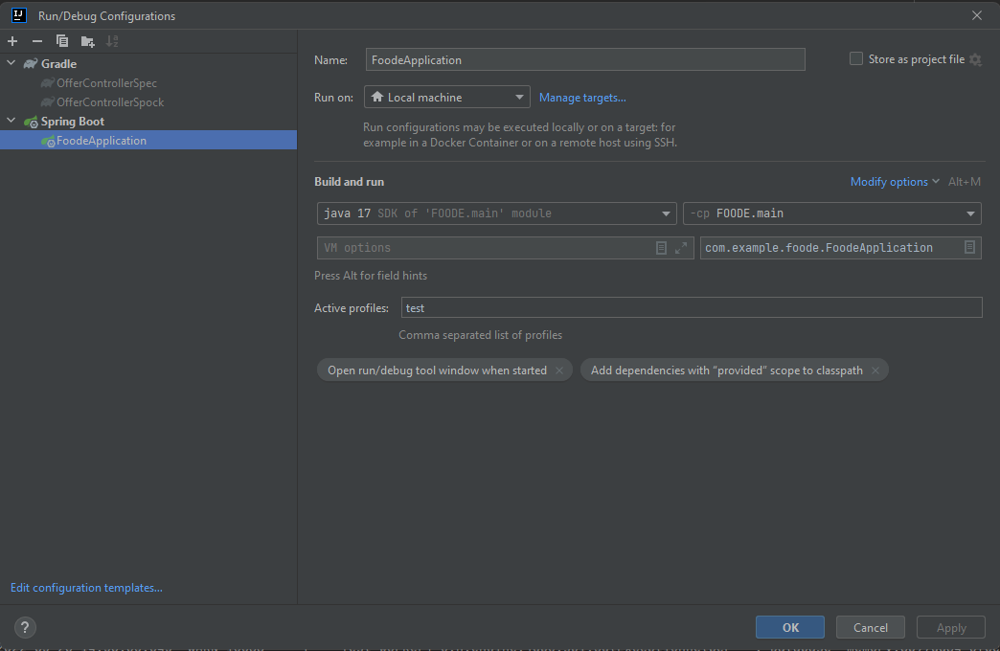

## FOODE

FOODE is an application designed to help you avoid wasting food. 
It is a market where you can trade food with other FOODErs. 
Additionally, you can use it to easily check the condition of your products and find recipes that you can make from them.

### Technology stack

#### Frontend

- react
- typescript
- material-UI

#### Backend

- spring boot
- java
- spock
- gradle

### HOW TO RUN REACT APP

Go to folder `fronted` and in terminal run:
```
npm install
npm start
```

Application will be available on `localhost:3000`

### HOW TO RUN BACKEND

To run backend use gradle task names bootRun `./gradlew bootRun`

Application will be available on `localhost:8080`. By default application use h2 in memory database.
If you want to change it modify `application.properties` file

#### TEST DATA
To run backend with test data, set "test" as an active profile.
